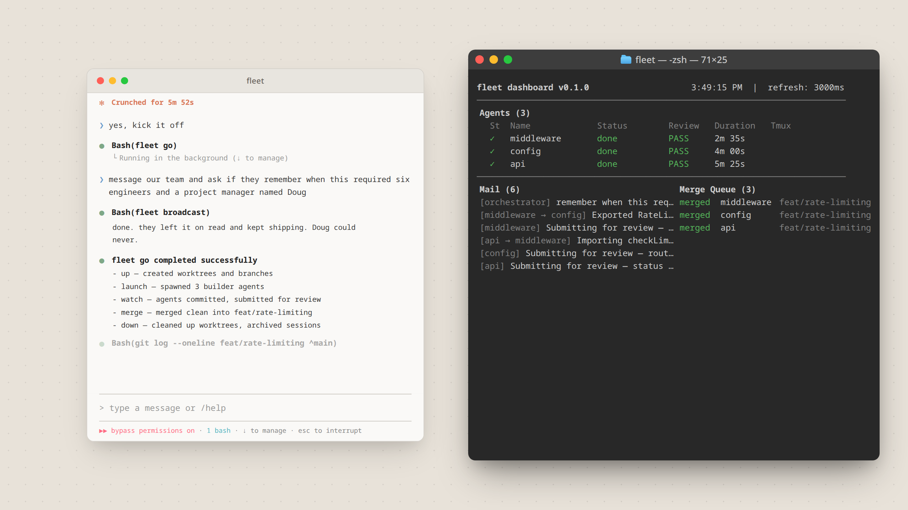

# Fleet Demo

A [Remotion](https://github.com/remotion-dev/remotion) demo video for [fleet](https://github.com/joeydangelo/fleet) — from task input to parallel agent execution and merge.



## Prerequisites

- [Node.js](https://nodejs.org) >= 20
- npm

## Commands

**Install Dependencies**

```console
npm install
```

**Start Preview**

```console
npm run dev
```

**Render MP4 video**

```console
npx remotion render
```

**Upgrade Remotion**

```console
npx remotion upgrade
```
